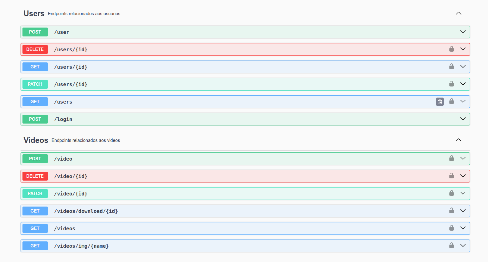

<h1 align="center">
  <p>PandaTube API 🎥</p>
</h1>

<h3 align="center">
  Api Node + TS | Express.js | Firestore | Swagger
</h3>

<p align="center">
  <a href="#sobre-wave">Sobre</a>&nbsp;&nbsp;&nbsp;|&nbsp;&nbsp;&nbsp;
  <a href="#como-usar-rocket">Como Usar</a>&nbsp;&nbsp;&nbsp;|&nbsp;&nbsp;&nbsp;
  <a href="#funcionalidades-star">Funcionalidades</a>&nbsp;&nbsp;&nbsp;|&nbsp;&nbsp;&nbsp;
  <a href="#tecnologias-man_technologist">Tecnologias</a>
</p>

<p align="center">
  
<p>


## Sobre :wave:

Essa API oferece recursos para o cadastro de usuários e o gerenciamento completo dos vídeos cadastrados.
É possível realizar um `CRUD` sendo capaz de criar, visualizar, editar e remover cada vídeo.


## Como Usar :rocket:

**Para acessar a documentação da API, utilize a rota `/docs` para mais detalhes**

## Instalação

Para executar a aplicação, realize os passos a seguir:

* Clone o repositório ou realize um fork para o seu GitHub.
* Entre no diretório do projeto --> `cd pandaTube/back`.
* Instale as dependências do projeto --> `npm install`.
* Execute a aplicação --> `npm run dev`.


## Funcionalidades :star:

Vamos trabalhar em cima de duas collections do Cloud Firestore:

 - `Users`
 - `Videos`

Em relação ao schema do `Users`, é possível acessar as seguintes rotas:

 - `POST /user`
 > Cria um novo usuário com os dados fornecidos no corpo da requisição, verifica se o email do usuário já existe no banco de dados, realiza a criptografia da senha do usuário e valida os campos do body.

 - `POST /login`
 > Autentica o usuário com email e senha, retorna um token JWT de acesso e valida os campos do body.

 - `GET /users/{id}`
 > Retorna um usuário com o ID especificado, valida se o id é passado como parâmetro na rota e se o token JWT de acesso é válido.

 - `GET /users`
 > Retorna uma lista com todos os usuários cadastrados e valida se o token JWT de acesso é válido.

 - `PATCH /users/{id}`
 > Retorna um usuário atualizado com o ID especificado, valida se o id é passado como parâmetro na rota e se o token JWT de acesso é válido e valida os campos do body.

 - `DELETE /users/{id}`
 > Deleta o usuário identificado pelo ID fornecido na rota, valida se o id é passado como parâmetro na rota e se o token JWT de acesso é válido.


```BASH
// Exemplo de acesso para a rota get /users

http://localhost:3001/users
```

Em relação ao schema dos `Videos`, é possível acessar as seguintes rotas:

 - `POST /video`
 > Cria um novo vídeo com os dados fornecidos no corpo da requisição e valida os campos do body.

 - `GET /videos/{id}`
 > Retorna um vídeo com o ID especificado, valida se o id é passado como parâmetro na rota.

 - `GET /videos`
 > Retorna uma lista com todos os vídeos cadastrados.

 - `GET /videos/download/{id}`
 > Realiza o download do vídeo na pasta public/videos para ser acessado pelo usuário.

 - `GET /videos/img/{name}`
 > Retorna uma imagem com o nome especificado para ser usada de thumbnail, valida se o nome é passado como parâmetro na rota.

 - `PATCH /product/{id}`
 > Retorna as informações atualizadas do produto, valida se o id é passado como parâmetro na rota, se o token JWT de acesso é válido e valida os campos do body.

 - `DELETE /video/{id}`
 > Deleta um vídeo identificado pelo ID fornecido na rota e valida se o id é passado como parâmetro na rota.

```BASH
// Exemplo de acesso para a rota get /products

http://localhost:3001/products
```


## Tecnologias :man_technologist:

Segue abaixo a lista de tecnologias utilizada no projeto:

 - `Node`
 > Plataforma de desenvolvimento para criação de aplicações server-side em JavaScript;
 - `Express`
 > Framework web minimalista para Node.js;
 - `TypeScript`
 > Linguagem que adiciona tipagem estática ao JavaScript, tornando-o mais seguro e produtivo para o desenvolvimento de software.
 - `tsx`
 > Ferramenta que monitora as alterações no código e reinicia o servidor automaticamente;
 - `Firebase`
 > Plataforma de desenvolvimento de aplicativos móveis e da web;
 - `Cloud Firestore`
 > Banco de dados NoSQL hospedado na nuvem do Firebase;
 - `EsLint`
 > Ferramenta para análise estática de código JavaScript;
 - `http-status-codes`
 > Biblioteca que fornece uma lista de códigos de status HTTP comuns em JavaScript.
 - `Bcrypt`
 > Biblioteca para criptografia de senhas;
 - `Json Web Token (JWT)`
 > Padrão de token de acesso utilizado para autenticação e autorização em aplicações web;
 - `Swagger`
 > Ferramenta para documentação de APIs;

---