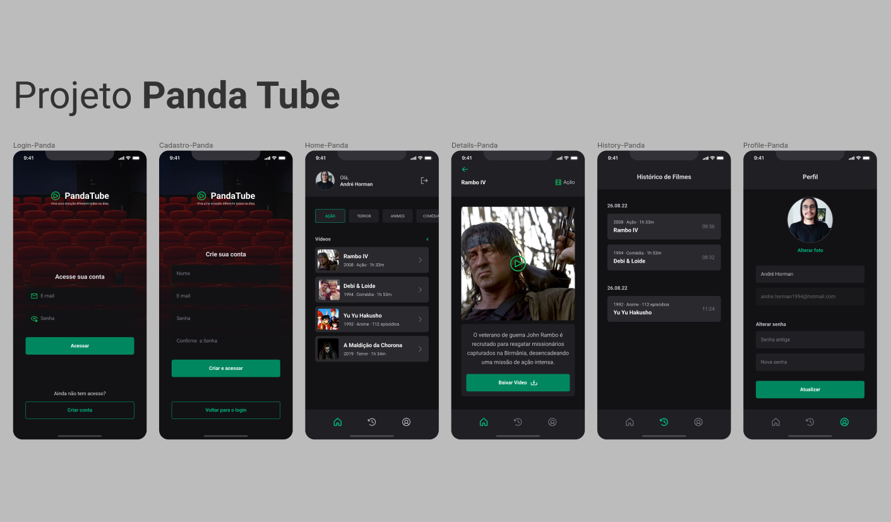

<h1 align="center">
  PandaTube 🎥
</h1>

<h3 align="center">
  React Native + TS | Expo | Native Base | Navigation
</h3>

  <a href="#bookmark-sobre">Sobre</a>&nbsp;&nbsp;&nbsp;|&nbsp;&nbsp;&nbsp;
  <a href="#computer-rotas-da-aplicação">Rotas do App</a>&nbsp;&nbsp;&nbsp;|&nbsp;&nbsp;&nbsp;
  <a href="#rocket-tecnologias">Tecnologias</a>&nbsp;&nbsp;&nbsp;|&nbsp;&nbsp;&nbsp;

  

## :bookmark: Sobre

Esta aplicação foi desenvolvida com o objetivo de apresentar um dispositivo mobile para IOS ou Android capaz de reproduzir vídeos. Nela, os usuários podem efetuar login com uma conta existente, criar um novo cadastro, explorar a lista de filmes disponíveis na área do usuário após o login, realizar buscas por categoria e acessar os detalhes do filme. Além disso, é possível navegar entre as rotas do histórico de atividades e das informações de perfil.
 

## Instalação

Para executar a aplicação, realize os passos a seguir:

* Clone o repositório ou realize um fork para o seu GitHub.
* Entre no diretório do projeto --> `cd pandaTube/front`.
* Instale as dependências do projeto --> `npm install`.
* Execute a aplicação --> `npm run dev`.

## :computer: Rotas da aplicação
 - Tela de Login ✅
 - Tela de Cadastro ✅
 - Tela Principal ✅
 - Tela de Detalhes ✅
 - Tela do Histórico ✅
 - Tela de Perfil ✅

## :rocket: Tecnologias

  - `React Native`
  > Biblioteca JavaScript para criar interfaces de usuário em aplicativos móveis Android e iOS.
  - `TypeScript`
  > Linguagem que adiciona tipagem estática ao JavaScript, tornando-o mais seguro e produtivo para o desenvolvimento de software.
  - `Expo`
  > Plataforma de código aberto para criar aplicativos nativos universais para Android, iOS e web com JavaScript e React.
  - `React Navigation`
  > Biblioteca que permite a navegação entre componentes e telas em aplicativos React Native.
  - `Native Base`
  > Biblioteca de componentes de interface de usuário de código aberto para React Native.
  - `Material Icons`
  > Biblioteca de ícones de material design para React Native.
  - `Yup`
  > Biblioteca JavaScript para validação de esquemas.
  - `React Hook Form`
  > Biblioteca JavaScript para validação de formulários.
  - `EsLint`
  > Ferramenta de análise de código estática para identificar padrões problemáticos encontrados no código JavaScript.

## Figma

- [Layout da Aplicação](https://www.figma.com/file/oHdJm4Kmv0IUh9exoL2wC0/Panda-Tube?type=design&node-id=37%3A6&mode=dev)

---